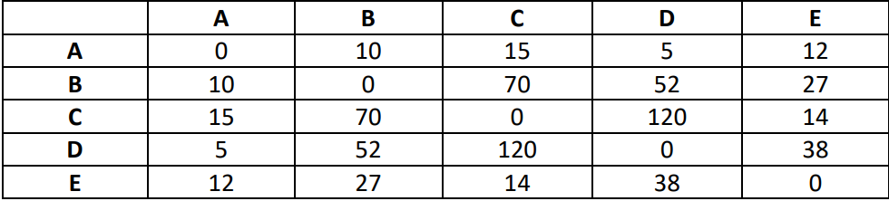

<h1>Problema do Caixeiro Viajante</h1>

    O problema do Caixeiro Viajante é encontrar o melhor caminho a ser
    percorrido, no menor tempo, levando em consideração a tolerância de erros e a
    quantidade de cidades, nas quais não podem ser repetidas, isto é, se o número de
    cidades for igual a dez, o caixeiro deve passar pelas dez cidades, sem retornar a
    nenhuma, no menor tempo possível (Ferreira, 2007).

    Para Reinelt (1994) o problema do caixeiro viajante atrai pesquisadores de diversas
    áreas, como por exemplo, físicos, biólogos, matemáticos, entre outros, já que se
    utilizando dessa técnica, é possível encontrar várias respostas para questões
    de otimização combinatória e pela simplicidade de sua formulação. Goldberg & Luna
    (1999) apud Cunha, Bonasser & Abrahão (2002) a origem do problema é um jogo
    criado por William Rowan Hamilton, com objetivo de traçar um roteiro através dos
    vértices de um dodecaedro que iniciam e terminam no mesmo vértice (cidade)
    sem repetir visitas

AVALIAÇÃO

    Desenvolver um sistema, com interface gráfica, que possibilite cadastrar uma
    quantidade de cidades (LIMITAR A 10) com os respectivos nomes e os tempos (em
    minutos) entre um e outra.

    Por exemplo, vamos supor que o usuário tenha solicitado o cadastro de 5 cidades:
    A – B – C – D – E

    O cadastro dos tempos deve prever que seja possível estabelecer o tempo entre todas
    as opções:

